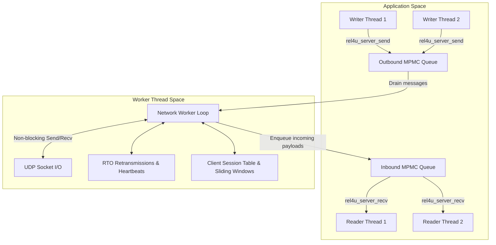
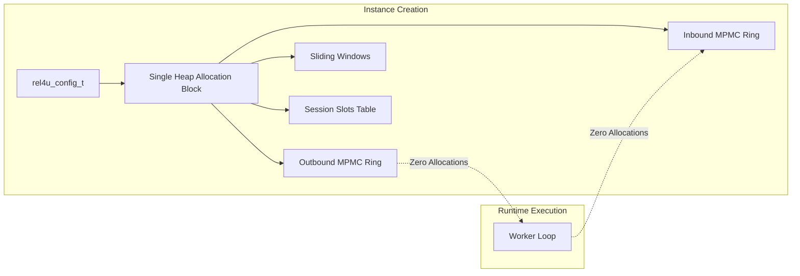

# rel4u System Architecture & Design

`rel4u` (Reliable Messaging for UDP) is a high-performance, low-latency, production-grade C11 library providing reliable and ordered message delivery over raw UDP sockets. It is designed for applications demanding predictable memory footprint, minimal latency overhead, and multi-threaded safety (such as game servers, simulation systems, real-time robotics, and telemetry pipelines).

---

## 1. Design Principles

1. **Minimal Dynamic Memory Allocation:** Dynamic allocation (`malloc`/`calloc`) is restricted exclusively to instance creation (`rel4u_server_create`, `rel4u_client_create`). The packet processing fast-path (send, receive, ACK, retransmit) performs **zero** runtime allocations.
2. **Predictable Memory Footprint:** All ring buffers, slot tables, packet pools, and internal queues are pre-allocated according to user configuration at initialization.
3. **Thread-Safe Bounded Queues:** Inter-thread communication between application threads (writers/readers) and the background network worker thread is decoupled using bounded, thread-safe Multi-Producer Multi-Consumer (MPMC) ring buffers.
4. **Dedicated Network Worker:** Socket I/O polling, packet serialization/deserialization, sliding window retransmissions, keepalives, and SACK processing run asynchronously in a dedicated worker thread.
5. **MTU-Bounded (No Fragmentation):** To preserve low overhead and avoid complex reassembly bottlenecks, messages exceeding the configured Maximum Transmission Unit (MTU minus 24-byte header) are rejected at the API boundary.
6. **Zero External Dependencies:** Implemented strictly in C11 (`-std=c11`) using standard C libraries and native OS networking/threading APIs (POSIX, Win32/WinSock2).

---

## 2. System Topology

```
+-----------------------------------------------------------------------------------+
|                                 SERVER APPLICATION                                |
|                                                                                   |
|  +------------------------+  +------------------------+  +---------------------+  |
|  |    Writer Thread(s)    |  |    Reader Thread(s)    |  |   Control Thread    |  |
|  |  rel4u_server_send()   |  |  rel4u_server_recv()   |  | rel4u_server_*()    |  |
|  +-----------+------------+  +-----------^------------+  +---------------------+  |
+--------------|---------------------------|----------------------------------------+
               |                           |
    [Outbound MPMC Queue]       [Inbound MPMC Queue]
               |                           |
+--------------v---------------------------|----------------------------------------+
|                             REL4U SERVER WORKER                                   |
|  +-----------------------------------------------------------------------------+  |
|  | - I/O Polling Loop (poll / WSAPoll / kqueue)                                |  |
|  | - Client Session Table (Slots 0..MaxClients-1, LRU Eviction Tracker)        |  |
|  | - Per-Client Sliding Window / SACK Bitmask Engine / Jacobson-Karels RTO     |  |
|  | - Keepalive / Heartbeat / Inactivity Timeout Monitor                        |  |
|  +-------------------------------------+---------------------------------------+  |
|                                        | UDP Socket (Port S)                      |
+----------------------------------------|------------------------------------------+
                                         |
                              Internet / LAN (UDP)
         +-------------------------------+-------------------------------+
         |                                                               |
+--------v-------------------------------+     +-------------------------v----------+
|      CLIENT 1 WORKER THREAD            |     |        CLIENT N WORKER THREAD      |
| - Single Server Session Engine         |     | - Single Server Session Engine     |
| - Sliding Window / SACK / RTO          |     | - Sliding Window / SACK / RTO      |
| - Send/Recv MPMC Queues                |     | - Send/Recv MPMC Queues            |
+----------------------------------------+     +------------------------------------+
|          CLIENT 1 APP THREADS          |     |           CLIENT N APP THREADS     |
+----------------------------------------+     +------------------------------------+
```

### Component Roles

- **Server (`rel4u_server_t`):** Binds a single UDP port. Manages $1 \dots N$ concurrent client sessions in pre-allocated slots up to `max_clients`.
- **Client (`rel4u_client_t`):** Connects to a single target server endpoint `(IP, Port)`.
- **Stream Model:** Each client session operates a single bidirectional logical channel with independent sequence number spaces for sending and receiving across delivery modes.

---

## 3. Threading & Concurrency Model

`rel4u` completely decouples application logic from network execution using an actor-like threading model:



### Thread Safety Guarantees

1. **Multiple Concurrent Writers:** Any number of application threads can simultaneously call `rel4u_server_send()` or `rel4u_client_send()`.
2. **Multiple Concurrent Readers:** Any number of application threads can simultaneously call `rel4u_server_recv()` or `rel4u_client_recv()`.
3. **Robust Synchronization:** Inter-thread communication uses mutex- and condition-variable-protected bounded FIFO circular queues with zero busy-spinning on pop waits.
4. **Isolated Network Worker:** Socket polling (`poll()`), sliding window state updates, SACK generation, and timeout calculations run single-threaded within the worker thread, avoiding complex multi-threaded locking on protocol states.

---

## 4. Delivery Modes

Every message transmitted through `rel4u` can specify one of four delivery guarantee modes:

| Mode Identifier | Reliability | Ordering | Retransmission | Reassembly Behavior | Ideal Use Case |
|---|---|---|---|---|---|
| `REL4U_MODE_UNRELIABLE_UNORDERED` | None | None | None | Delivered immediately to receive queue upon arrival. | High-frequency telemetry, voice streams, volatile sensor readings. |
| `REL4U_MODE_UNRELIABLE_ORDERED` | None | Sequenced | None | Dropped if sequence number $\le$ highest received sequence number. | Player position updates, camera transforms (drop stale state). |
| `REL4U_MODE_RELIABLE_UNORDERED` | Guaranteed | None | SACK / RTO | Delivered to receive queue on first arrival (duplicates dropped). | Chat messages, inventory adjustments, non-sequential events. |
| `REL4U_MODE_RELIABLE_ORDERED` | Guaranteed | Strict Sequential | SACK / RTO | Held in sliding window until missing gaps arrive, delivered in order. | RPC commands, financial transactions, deterministic state synchronization. |

---

## 5. Memory Management & Allocation Strategy

Memory consumption is deterministic and bounded:



- When `rel4u_server_create()` or `rel4u_client_create()` is called, all required memory buffers (MPMC slots, packet store, session metadata, sliding window frames) are pre-allocated.
- During steady-state message exchange, **zero calls to `malloc()` or `free()`** occur.
- Rejection or queue backpressure occurs gracefully via error return codes (`REL4U_ERR_QUEUE_FULL`, `REL4U_ERR_SERVER_FULL`) without memory fragmentation.
