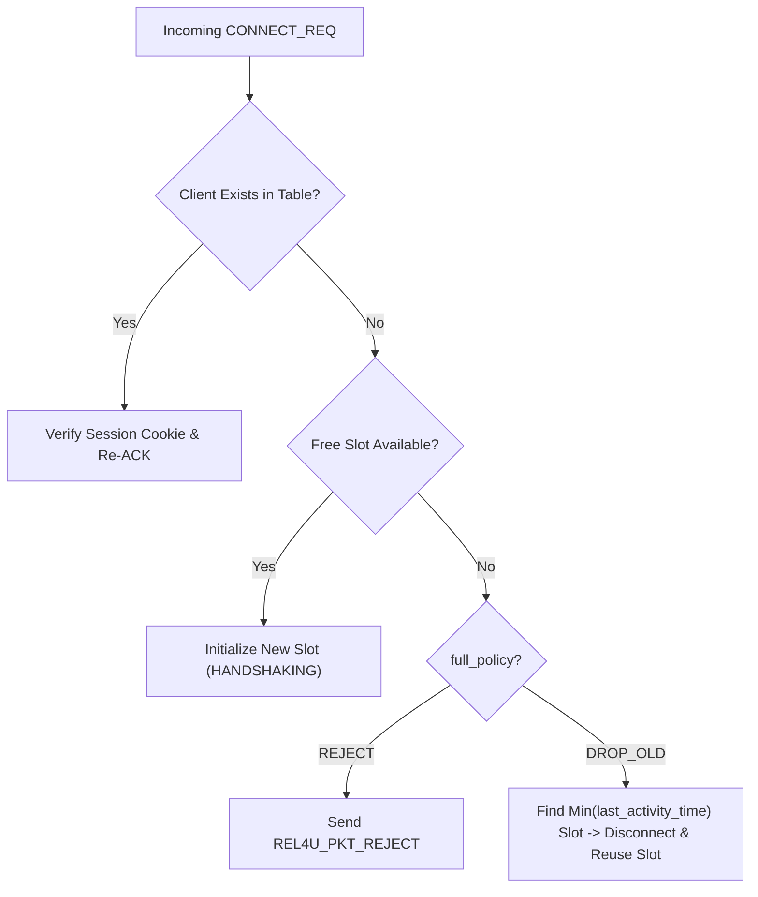

# rel4u Internal Architecture & Subsystems

This document provides a deep dive into the internal data structures, queue synchronization mechanisms, and platform abstraction layers implemented in `src/core/` and `src/platform/`.

---

## 1. Directory Structure

```
rel4u/
├── include/
│   └── rel4u.h             # Public C11 API
├── src/
│   ├── core/
│   │   ├── rel4u_client.c  # Client lifecycle & worker loop
│   │   ├── rel4u_server.c  # Server lifecycle & multiplexing loop
│   │   ├── rel4u_session.c # Client session table & LRU eviction
│   │   ├── rel4u_session.h
│   │   ├── rel4u_window.c  # Sliding window, SACK & reassembly
│   │   ├── rel4u_window.h
│   │   ├── rel4u_mpmc.c    # Thread-safe bounded MPMC ring buffer
│   │   ├── rel4u_mpmc.h
│   │   ├── rel4u_packet.c  # Packet header packing/unpacking
│   │   ├── rel4u_packet.h
│   │   ├── rel4u_rtt.c     # Jacobson-Karels RTT/RTO tracking
│   │   └── rel4u_rtt.h

---

## 2. Thread-Safe MPMC Queue (Fixed & Dynamic Modes)

The inter-thread queues connecting application threads to the background worker (`send_queue`, `recv_queue`) use a **thread-safe Multi-Producer Multi-Consumer (MPMC)** queue synchronized via mutex and condition variable primitives, supporting both **Fixed Pre-allocated** and **Dynamic Allocation** models.

### Queue Structure

```c
typedef struct rel4u_mpmc_node {
    uint32_t                 client_id;
    uint8_t                  mode;
    uint16_t                 len;
    size_t                   allocated_size;
    struct rel4u_mpmc_node*  prev;
    struct rel4u_mpmc_node*  next;
    uint8_t                  data[];
} rel4u_mpmc_node_t;

typedef struct rel4u_mpmc_queue {
    rel4u_memory_mode_t        mode;
    rel4u_queue_full_policy_t  full_policy;
    size_t                     max_bytes;       /* Dynamic mode byte limit */
    size_t                     current_bytes;   /* Current heap / buffer bytes */
    uint64_t                   dropped_count;   /* Total items dropped or evicted */

    /* Fixed mode ring buffer */
    rel4u_mpmc_item_t*         items;
    size_t                     capacity;
    size_t                     head;
    size_t                     tail;

    /* Dynamic mode linked list */
    rel4u_mpmc_node_t*         node_head;
    rel4u_mpmc_node_t*         node_tail;

    size_t                     count;
    rel4u_mutex_t              mutex;
    rel4u_cond_t               cond;
} rel4u_mpmc_queue_t;
```

### Memory Modes & Full Policies

1. **Fixed Memory Mode (`REL4U_MEM_FIXED`):**
   - Pre-allocates a ring buffer array of `capacity` slots at initialization.
   - Zero heap allocations (`malloc`/`free`) occur on the fast path during push/pop.
2. **Dynamic Memory Mode (`REL4U_MEM_DYNAMIC`):**
   - Each queued message dynamically allocates a node sized exactly to `sizeof(rel4u_mpmc_node_t) + len`.
   - Node memory is freed immediately upon being popped or evicted.
   - Queue capacity is bounded strictly by `max_bytes` (sum of node overhead and message payloads).
3. **Queue Full Policies:**
   - **`REL4U_QUEUE_FULL_DROP_NEW`:** If the queue reaches capacity (fixed) or `current_bytes + needed > max_bytes` (dynamic), incoming messages are rejected and `dropped_count` increments.
   - **`REL4U_QUEUE_FULL_DROP_LAST`:** When full, the oldest queued item(s) at the head are evicted to make room for the new message, ensuring newer data is always accepted.

---

## 3. Sliding Window & Out-of-Order Reassembly

Each client connection manages an independent **Send Sliding Window** and **Receive Sliding Window**.

```
Send Window:
[ ...Acked... ] [  In-Flight / Unacked  ] [  Available Capacity  ]
----------------+-----------------------+-------------------------
0               base                    base + window_size
```

### Send Sliding Window (`rel4u_send_window_t`)
- Buffers sent reliable packets until cumulative ACK (`ack_num`) or SACK bit confirms delivery.
- Retransmission timer scans in-flight slots; if `current_time - slot.sent_time >= RTO`, the packet is scheduled for immediate retransmission.
- Exponential backoff is applied on consecutive packet drops.

### Receive Sliding Window (`rel4u_recv_window_t`)
- **Unreliable Ordered:** Directly checks incoming `seq_num > highest_seq`. If true, advances `highest_seq` and delivers; otherwise drops as stale.
- **Reliable Ordered:** Buffers out-of-order packets into a pre-allocated reassembly ring.
  - When packet `seq_num == expected_seq`, delivers it and any contiguous buffered successors immediately to the `recv_queue`.
  - Updates `ack_num` to the highest contiguous delivered sequence.
  - Sets corresponding bits in `sack_mask` for isolated gaps.

---

## 4. Session Table & LRU Eviction

The server stores active client connections in a pre-allocated slot array (`rel4u_session_t slots[max_clients]`).



### Zero-Allocation LRU Strategy
- Each session slot tracks `last_activity_timestamp`.
- When `full_policy == REL4U_MAX_CLIENTS_DROP_OLD` and all slots are full, the server performs an $O(N)$ scan to identify the slot with the oldest timestamp, sends a disconnect notification to that client, cleans its window state, and assigns the slot to the newcomer.

---

## 5. Platform Abstraction Layer (`src/platform/`)

To guarantee seamless compilation across Linux, Windows, macOS, and BSD systems without `#ifdef` pollution in core code:

| Platform Component | POSIX / Linux / BSD | Windows (WinSock2 / Win32) |
|---|---|---|
| **Sockets & I/O** | `socket(AF_INET, SOCK_DGRAM)`, `poll()` / `kqueue()` | `WSASocket()`, `WSAPoll()` |
| **Non-blocking Mode** | `fcntl(fd, F_SETFL, O_NONBLOCK)` | `ioctlsocket(s, FIONBIO, ...)` |
| **Threads & Atomics** | `pthread_create`, `<stdatomic.h>` / C11 threads | `CreateThread` / `_beginthreadex`, `<stdatomic.h>` / Interlocked |
| **Monotonic Clock** | `clock_gettime(CLOCK_MONOTONIC)` | `QueryPerformanceCounter()` |
