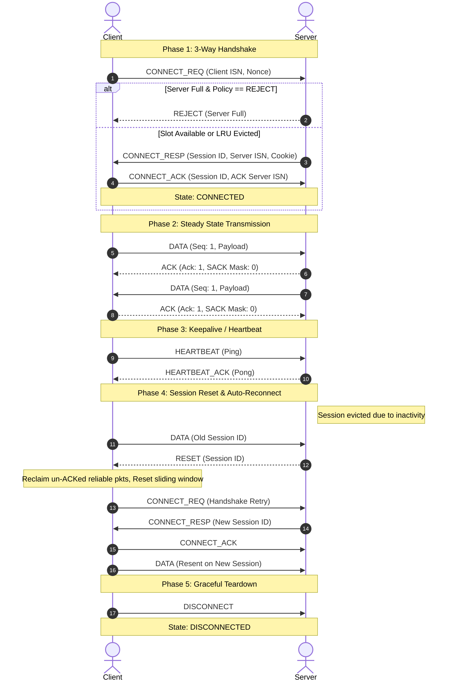
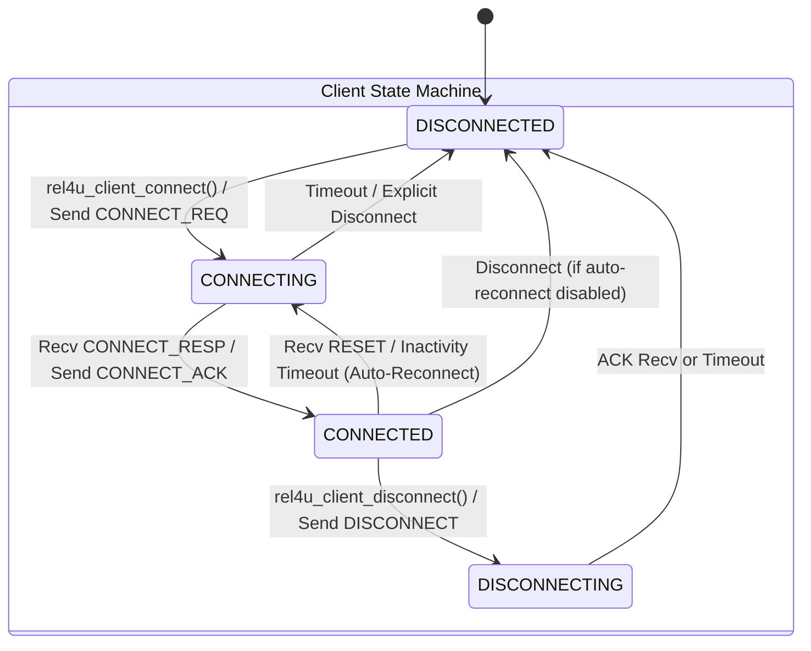
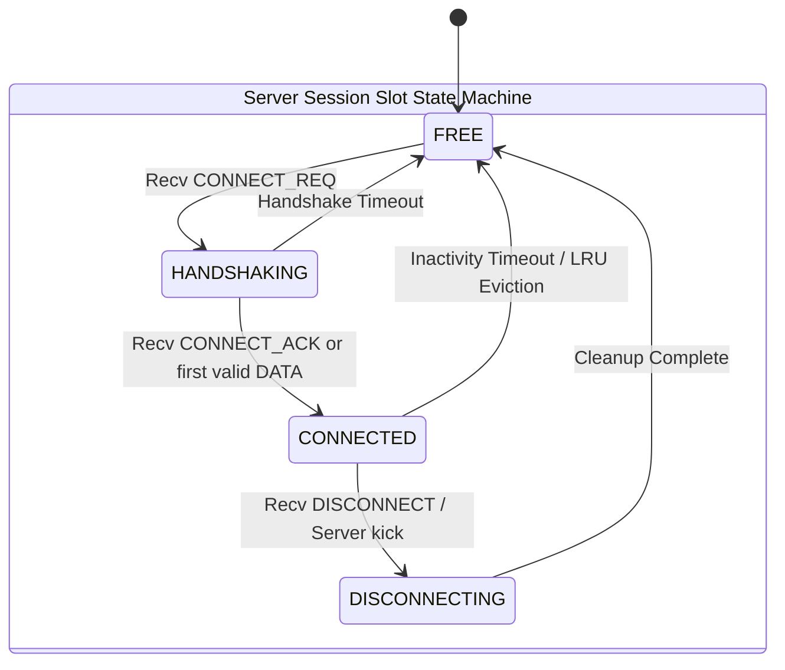

# rel4u Wire Protocol Specification

This document defines the wire protocol, binary packet layout, connection handshake, state machines, and reliability mechanisms used in `rel4u`.

---

## 1. Binary Packet Header

All multi-byte integers in `rel4u` headers are encoded in **Network Byte Order (Big-Endian)** using `htons`/`ntohs` and `htonl`/`ntohl`.

The header is fixed at **24 bytes**:

```
 0                   1                   2                   3
 0 1 2 3 4 5 6 7 8 9 0 1 2 3 4 5 6 7 8 9 0 1 2 3 4 5 6 7 8 9 0 1
+-+-+-+-+-+-+-+-+-+-+-+-+-+-+-+-+-+-+-+-+-+-+-+-+-+-+-+-+-+-+-+-+
|          Magic (0x3455)       |    Version    |  Packet Type  |
+-+-+-+-+-+-+-+-+-+-+-+-+-+-+-+-+-+-+-+-+-+-+-+-+-+-+-+-+-+-+-+-+
| Delivery Mode |     Flags     |          Payload Length       |
+-+-+-+-+-+-+-+-+-+-+-+-+-+-+-+-+-+-+-+-+-+-+-+-+-+-+-+-+-+-+-+-+
|                          Session ID                           |
+-+-+-+-+-+-+-+-+-+-+-+-+-+-+-+-+-+-+-+-+-+-+-+-+-+-+-+-+-+-+-+-+
|                        Sequence Number                        |
+-+-+-+-+-+-+-+-+-+-+-+-+-+-+-+-+-+-+-+-+-+-+-+-+-+-+-+-+-+-+-+-+
|                     Acknowledgment Number                     |
+-+-+-+-+-+-+-+-+-+-+-+-+-+-+-+-+-+-+-+-+-+-+-+-+-+-+-+-+-+-+-+-+
|                        SACK Bitmask                           |
+-+-+-+-+-+-+-+-+-+-+-+-+-+-+-+-+-+-+-+-+-+-+-+-+-+-+-+-+-+-+-+-+
|                         Payload Data                          |
|                             ...                               |
+-+-+-+-+-+-+-+-+-+-+-+-+-+-+-+-+-+-+-+-+-+-+-+-+-+-+-+-+-+-+-+-+
```

### Header Fields

| Field | Size | Offset | Description |
|---|---|---|---|
| `magic` | 2 bytes | 0 | Protocol Identifier constant: `0x3455` (`'4'`, `'U'`). Malformed packets lacking this magic are discarded immediately. |
| `version` | 1 byte | 2 | Protocol version (current: `0x01`). |
| `packet_type` | 1 byte | 3 | Type of message/control packet (see [Packet Types](#2-packet-types)). |
| `delivery_mode` | 1 byte | 4 | Delivery guarantee mode: `0` (UnrelUnord), `1` (UnrelOrd), `2` (RelUnord), `3` (RelOrd). |
| `flags` | 1 byte | 5 | Control flags (e.g. `REL4U_FLAG_ACK_IMMEDIATE = 0x01`). |
| `payload_len` | 2 bytes | 6 | Payload length in bytes ($0 \le \text{len} \le \text{MTU} - 24$). |
| `session_id` | 4 bytes | 8 | 32-bit session token generated during handshake for connection identification. |
| `seq_num` | 4 bytes | 12 | 32-bit monotonically increasing sequence number for this delivery channel. |
| `ack_num` | 4 bytes | 16 | Cumulative ACK: highest contiguous sequence number successfully received. |
| `sack_mask` | 4 bytes | 20 | 32-bit Selective ACK bitmask for out-of-order received packets. |

---

## 2. Packet Types

```c
typedef enum rel4u_pkt_type {
    REL4U_PKT_CONNECT_REQ   = 0x01, // Client -> Server: Connection Request (SYN)
    REL4U_PKT_CONNECT_RESP  = 0x02, // Server -> Client: Connection Response (SYN-ACK)
    REL4U_PKT_CONNECT_ACK   = 0x03, // Client -> Server: Handshake Completion (ACK)
    REL4U_PKT_DATA          = 0x04, // Application Data Payload
    REL4U_PKT_ACK           = 0x05, // Standalone ACK / SACK notification
    REL4U_PKT_HEARTBEAT     = 0x06, // Keepalive ping
    REL4U_PKT_HEARTBEAT_ACK = 0x07, // Keepalive pong response
    REL4U_PKT_DISCONNECT    = 0x08, // Graceful disconnect notice
    REL4U_PKT_REJECT        = 0x09, // Server rejection (server full / policy)
    REL4U_PKT_RESET         = 0x0A  // Server -> Client: Session Reset (Unknown / Evicted Session)
} rel4u_pkt_type_t;
```

---

## 3. Connection Lifecycle & 3-Way Handshake



### Connection Security (SYN Cookie Mechanism)

To prevent SYN flood attacks, the server can generate stateless verification tokens during `CONNECT_RESP`:
$$\text{SessionID} = \text{Hash32}(\text{ClientIP}, \text{ClientPort}, \text{ServerSecret}, \text{Timestamp})$$
The server validates this session ID when `CONNECT_ACK` is received before allocating or locking session resources.

---

## 4. Connection State Machines





---

## 5. Reliability: SACK & Sliding Window

### 5.1 Selective Acknowledgment (SACK) Bitmask

`rel4u` uses a cumulative acknowledgment field (`ack_num`) combined with a 32-bit selective ACK bitmask (`sack_mask`):

- `ack_num`: Sequence number of the highest contiguous packet received without gaps.
- `sack_mask`: Bit $i$ (for $0 \le i < 32$) represents receipt of packet $(\text{ack\_num} + 1 + i)$:
  - $\text{Bit } i = 1$: Packet $(\text{ack\_num} + 1 + i)$ has been received out-of-order.
  - $\text{Bit } i = 0$: Packet $(\text{ack\_num} + 1 + i)$ has not yet been received.

```
Received:  [100] [101] [102]  (missing 103)  [104]  (missing 105)  [106]
Header:    ack_num   = 102
           sack_mask = 0b0000...00001010
                       Bit 0 (103) = 0 (Missing)
                       Bit 1 (104) = 1 (Received)
                       Bit 2 (105) = 0 (Missing)
                       Bit 3 (106) = 1 (Received)
```

This enables the sender to retransmit **only missing packets** (103 and 105), avoiding duplicate transmissions of 104 and 106.

---

## 6. RTO Estimation (Jacobson-Karels Algorithm)

Round-Trip Time (RTT) and Retransmission Timeout (RTO) are continuously tracked per active connection using the standard Jacobson-Karels algorithm:

1. **Sample RTT Measurement ($M$):** Measured on standalone ACKs of non-retransmitted packets (Karn's Algorithm).
2. **Smoothed RTT ($\text{SRTT}$):**
   $$\text{SRTT}_{new} = (1 - \alpha) \times \text{SRTT}_{old} + \alpha \times M \quad (\alpha = 0.125)$$
3. **RTT Variation ($\text{RTTVAR}$):**
   $$\text{RTTVAR}_{new} = (1 - \beta) \times \text{RTTVAR}_{old} + \beta \times | \text{SRTT}_{old} - M | \quad (\beta = 0.25)$$
4. **Computed RTO:**
   $$\text{RTO} = \text{clamp}(\text{SRTT} + 4 \times \text{RTTVAR}, \text{RTO}_{min}, \text{RTO}_{max})$$
   - Default $\text{RTO}_{min} = 50\text{ ms}$, $\text{RTO}_{max} = 1000\text{ ms}$.
5. **Exponential Backoff:** On consecutive timeouts without ACK, $\text{RTO} \leftarrow \min(2 \times \text{RTO}, \text{RTO}_{max})$.
